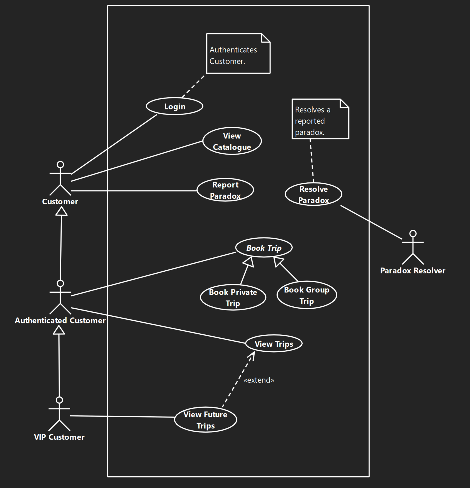
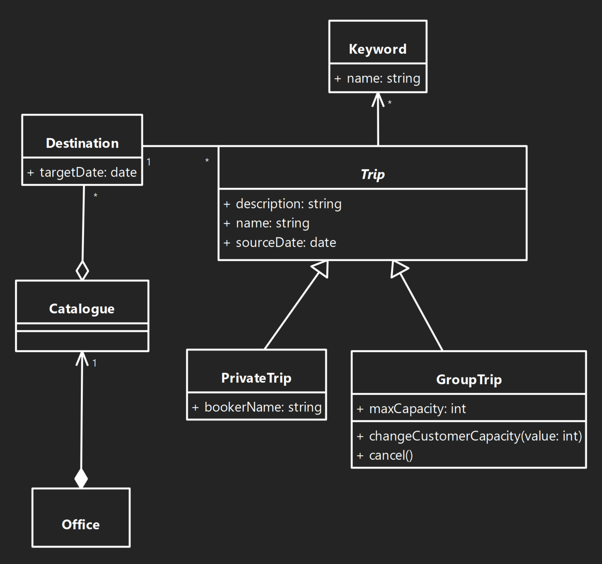
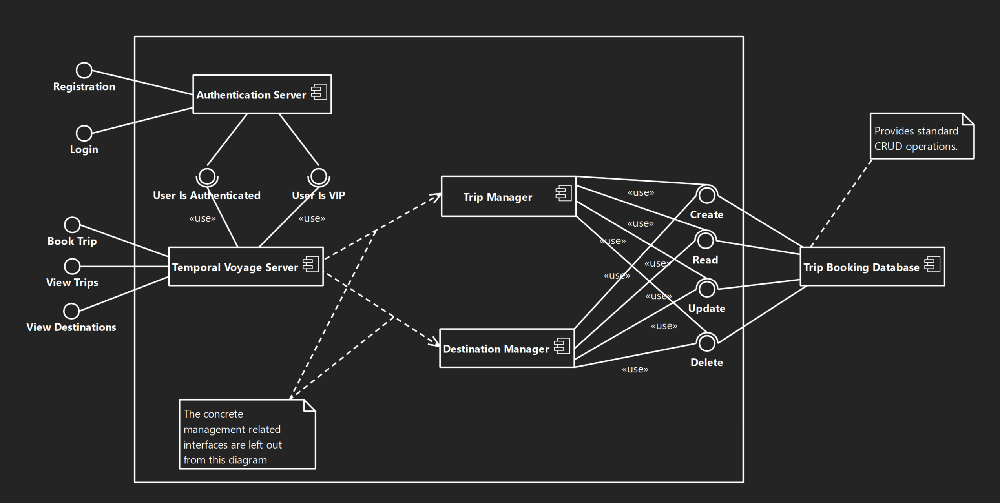

# Software Engineering (BMEVIMIAB04) - Modeling

This repository is meant to collect some UML diagrams made as a laboratory project for the Software Engineering course (BMEVIMIAB04) at Budapest Univsersity of Technology and Economics.

## Screenshots of the diagrams (may be outdated)

### Use-Case Diagram

### Class Diagram

### Component Diagram

